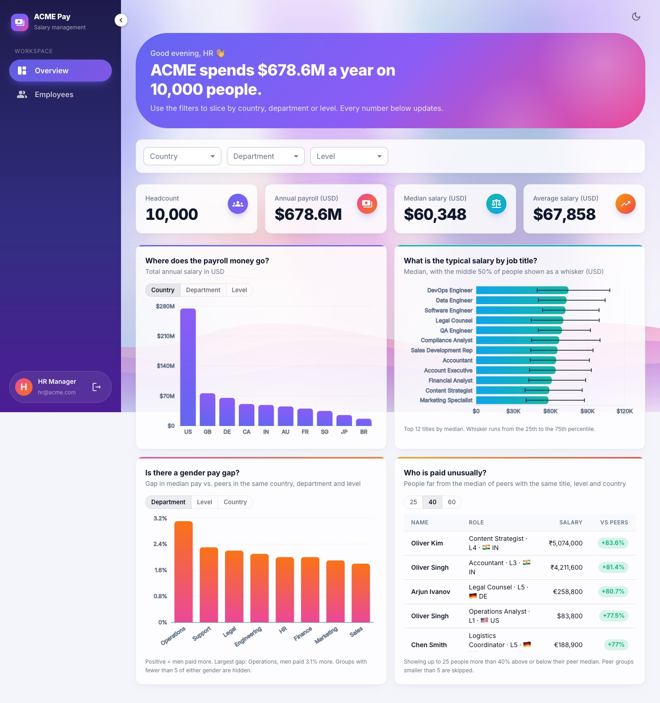
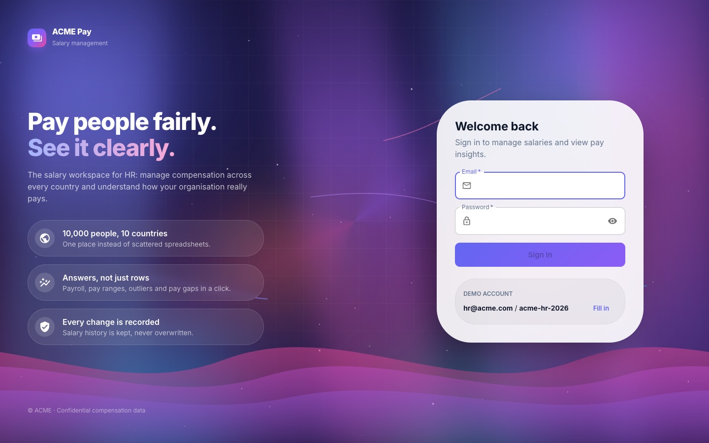
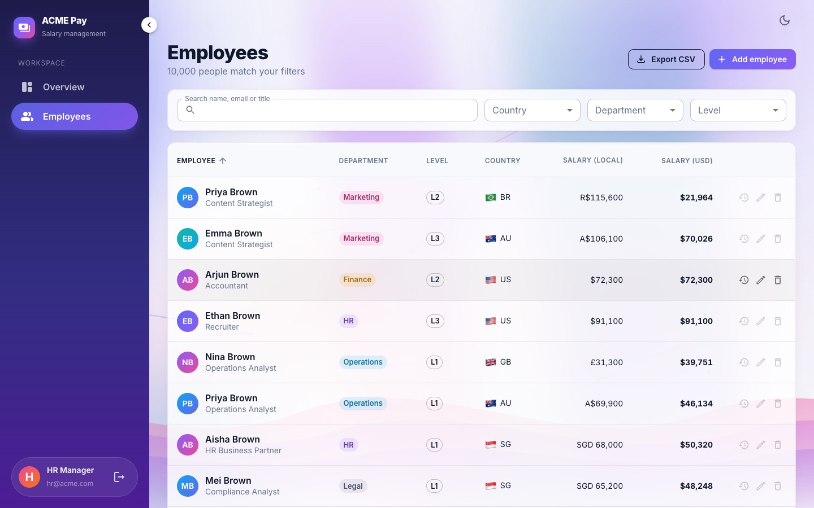
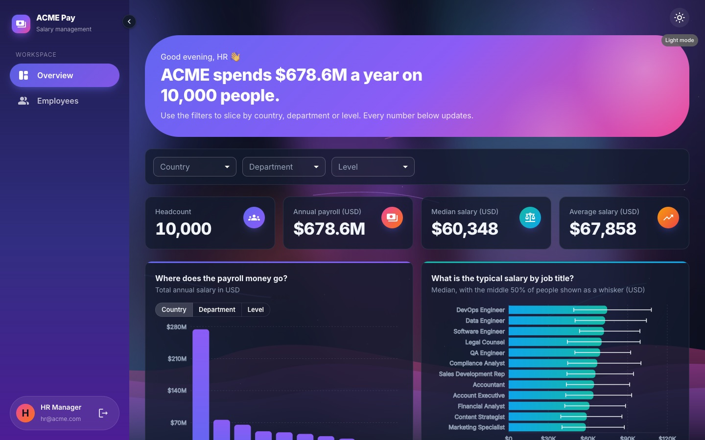
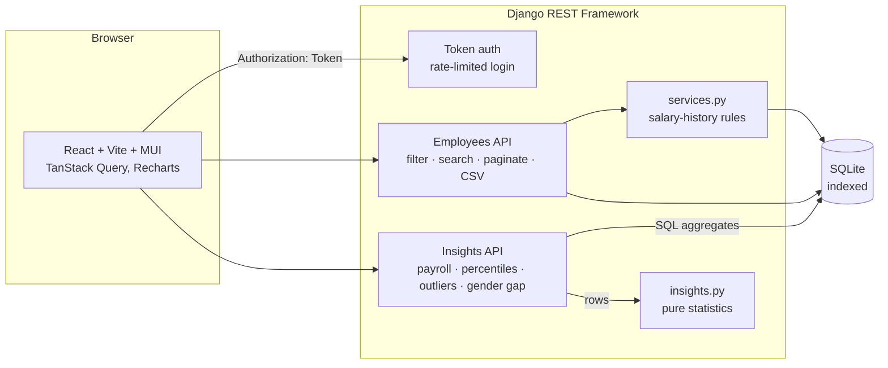

# ACME Pay: Salary Management

A web app that lets an HR manager manage salaries for a 10,000-person, multi-country organisation, and **answer questions about how the organisation pays people**, instead of doing it in Excel.

Django REST Framework + React (Vite) · SQLite · token auth · 100+ automated tests

**Live demo: https://acme-salary.onrender.com** (sign in with `hr@acme.com` / `acme-hr-2026`)

> Free hosting: the instance sleeps when idle, so the first load can take up to a minute. Data you change in the demo resets when it restarts. Details under [Deployment](#deployment).



<table>
  <tr>
    <td></td>
    <td></td>
  </tr>
  <tr>
    <td colspan="2"></td>
  </tr>
</table>

## The problem

ACME's HR team keeps salary data for 10,000 employees across several countries in spreadsheets. That is tedious and error-prone, and it makes questions like *"are we paying engineers in Germany fairly?"* slow to answer. This project replaces it with a web app built around one persona, **the HR Manager**.

The scope, and what was **deliberately left out** and why, is written up **before** any code in [`docs/requirements.md`](docs/requirements.md).

## What it does

**Answers the questions HR actually asks**

| Question | Where |
|---|---|
| How much do we spend, and where? | Overview: payroll by country / department / level |
| What is a typical salary for a job title? | Overview: median with 25th-75th percentile whiskers |
| Is there a gender pay gap? | Overview: gap vs. peers in the same country, department and level |
| Who is paid unusually? | Overview: outliers vs. same title, level and country (adjustable threshold) |
| What does this person earn, and how has it changed? | Employees: salary history dialog |

**Manages the data**
- Search, filter (country, department, level), sort and paginate 10,000 employees, all server-side.
- Add / edit / delete employees with validation. A raise **appends to salary history** instead of overwriting.
- Export the *currently filtered* list to CSV.
- Login / logout, light and dark mode, responsive layout, and a sidebar you can collapse or drag to resize.

## Architecture



```
backend/
  config/                Django settings, urls
  employees/
    models.py            Employee, SalaryRecord (append-only history)
    constants.py         countries, currencies, static FX rates
    services.py          write-side rules (history is recorded here)
    insights.py          pure statistics: percentiles, outliers, gender gap (no DB)
    seeding.py           deterministic synthetic data generator
    serializers.py, views.py, insight_views.py, auth_views.py, filters.py
    management/commands/ seed_employees, create_hr_user
    tests/               pytest suite
frontend/
  src/
    api/                 typed API client (token handling, CSV download)
    auth/                AuthContext, RequireAuth
    pages/               LoginPage, EmployeesPage, InsightsPage
    components/          Layout (adjustable sidebar), dialogs, charts, background
    insights/            data transforms + hooks
    sidebar.ts           sidebar sizing rules (pure, unit-tested)
  e2e/                   Playwright tests
docs/                    requirements, AI usage log, performance notes, screenshots
```

## Getting started

**Prerequisites:** Python 3.10+, Node 18+.

### 1. Backend

```bash
cd backend
python3 -m venv venv
venv/bin/pip install -r requirements.txt
venv/bin/python manage.py migrate
venv/bin/python manage.py seed_employees                       # 10,000 employees in ~1s (deterministic); refuses to run on a non-empty DB
venv/bin/python manage.py create_hr_user --password acme-hr-2026
venv/bin/python manage.py runserver 8000
```

### 2. Frontend

```bash
cd frontend
npm install
npm run dev          # http://localhost:5173, proxies /api to localhost:8000
```

Open http://localhost:5173 and sign in with **`hr@acme.com` / `acme-hr-2026`** (the login page has a "Fill in" button for the demo account).

### Configuration

| Variable | Where | Purpose |
|---|---|---|
| `DJANGO_SECRET_KEY` | backend | **Required** unless `DJANGO_DEBUG=1`; the app refuses to start without it |
| `DJANGO_DEBUG` | backend | Off unless set to `1`. `manage.py` (local dev tool) defaults it on; production must set `0` explicitly |
| `DJANGO_ALLOWED_HOSTS` | backend | Comma-separated hosts (default `localhost,127.0.0.1`) |
| `DJANGO_CORS_ORIGINS` | backend | Comma-separated frontend origins allowed in production (any origin is allowed only in debug) |
| `DJANGO_DB_PATH` | backend | SQLite file location (default `backend/db.sqlite3`) |
| `RENDER_EXTERNAL_HOSTNAME` | backend | Set automatically by Render; added to the allowed hosts |
| `DJANGO_SECURE_SSL_REDIRECT`, `DJANGO_HSTS_SECONDS` | backend | HTTPS redirect (default on when not debug) and HSTS lifetime (default 3600s) |
| `HR_USERNAME`, `HR_PASSWORD` | backend | The login email (default `hr@acme.com`) and password, used by `create_hr_user` when its flags are omitted |
| `VITE_API_URL` | frontend | API origin when UI and API are on different domains (empty in dev) |
| `VITE_SHOW_DEMO_LOGIN` | frontend | Set to `false` to hide the demo-credentials box on the login page |

## Deployment

The app ships as **one Docker image** that serves both the API and the built React app, so there is one URL and no CORS to configure. `render.yaml` describes it for [Render](https://render.com)'s free tier.

**Deploy (about 5 minutes, no code changes):**
1. Sign in to Render with GitHub.
2. **New > Blueprint**, choose this repository, click **Apply**.
3. Wait for the first build (a few minutes). Render creates the service, generates the secret key, and health-checks `/api/health/`.
4. Open the service URL (this project's is https://acme-salary.onrender.com) and sign in with the demo account (`hr@acme.com` / `acme-hr-2026`).

On every boot the container runs migrations, seeds the 10,000 employees (only if the database is empty), creates the HR login, and starts gunicorn. With `autoDeploy: true`, each push to `main` redeploys.

**Try the production image locally** (this is what was used to verify it, including the full Playwright suite):

```bash
docker build -t acme-salary .
docker run --rm -p 8080:8000 -e DJANGO_DEBUG=0 -e DJANGO_SECRET_KEY=any-local-value \
  -e HR_PASSWORD=acme-hr-2026 -e RENDER_EXTERNAL_HOSTNAME=localhost -e DJANGO_SECURE_SSL_REDIRECT=0 acme-salary
# http://localhost:8080
```

**What the free tier means (worth knowing before you demo it):**
- The instance **sleeps after ~15 minutes idle**, so the first request afterwards takes about 30-60 seconds to wake it.
- The disk is **ephemeral**: employees you add or edit in the live demo reset when the instance restarts, and the 10,000 seeded employees are recreated. That is acceptable for a demo on synthetic data; production would use a managed PostgreSQL.
- The demo credentials are public **on purpose** (synthetic data, and the login page shows them). For real data, remove `HR_PASSWORD` from `render.yaml`, set it privately in the dashboard, and build with `VITE_SHOW_DEMO_LOGIN=false`.

## Tests

```bash
# Backend: 101 tests, ~1s. In-memory test DB, no network or external services.
cd backend && venv/bin/pytest

# Frontend unit tests: 24 tests
cd frontend && npm test

# End-to-end (Playwright). Needs the backend (seeded) and frontend running as above.
cd frontend && npx playwright install chromium && npm run e2e     # 14 tests
```

What the tests cover, and why they are trustworthy:
- **Statistics** (`insights.py`) are pure functions tested with plain lists: percentile interpolation, outlier detection (including "a cheap-country salary is *not* an outlier"), and a test proving role mix cannot fake a gender gap.
- **Seed**: determinism (same seed, identical data), and safety: it refuses to delete existing data unless `--reset` is given, and `--if-empty` skips quietly.
- **API**: validation, history rules, filters, pagination caps, CSV export, and that **every data endpoint rejects anonymous requests** (only login is public).
- **Auth**: token grants access, logout revokes the token, bad credentials get one generic error; on the frontend, a network blip keeps you signed in while a rejected token signs you out.
- **Configuration**: production refuses to start without a secret key, debug is off by default, and hosts/CORS/HTTPS are locked down (each case runs in a fresh interpreter).
- **End-to-end**: sign-in/out flow, the full add, raise, history and delete journey (with cleanup that runs even when the test fails), sidebar collapse/drag/keyboard, and zero console errors on each page.

## API overview

All endpoints except login require `Authorization: Token <token>`.

| Method & path | Purpose |
|---|---|
| `POST /api/auth/login/` | Body `{username, password}` where `username` is the login **email** (case-insensitive, surrounding spaces ignored). Returns `{token, user}`. Rate-limited (20/min) |
| `POST /api/auth/logout/` | Revokes the token |
| `GET /api/auth/me/` | Current user |
| `GET /api/meta/` | Countries, departments, levels, job titles (for dropdowns) |
| `GET/POST /api/employees/` | List (filters: `country`, `department`, `level`, `gender`, `job_title`, `min_salary_usd`, `max_salary_usd`; `search`; `ordering`; `page`, `page_size` ≤ 100) / create |
| `GET/PATCH/DELETE /api/employees/{id}/` | Retrieve / update / delete |
| `GET /api/employees/{id}/salary-history/` | Salary history, newest first |
| `GET /api/employees/export/` | CSV of the filtered list (same query params) |
| `GET /api/insights/summary/` | Headcount, total payroll, mean, median |
| `GET /api/insights/payroll/?group_by=` | Totals by `country`, `department`, `level` or `job_title` |
| `GET /api/insights/percentiles/?group_by=` | P25 / median / P75 by group |
| `GET /api/insights/outliers/?threshold=&limit=` | People far from their peers |
| `GET /api/insights/gender-gap/?group_by=` | Pay-index gap by group |

Every insight endpoint accepts the same filters as the employee list.

## Key decisions and trade-offs

- **Money is stored as whole-unit integers plus a currency derived from the country**, never floats. A USD-normalised copy (`salary_usd`) is stored at write time using **static, documented FX rates**, so cross-country sorting, filtering and aggregation stay in SQL and reports are deterministic. Trade-off: changing a rate means recomputing that column.
- **Salary history is append-only.** A raise adds a row; the old value is never lost. Moving country (a currency change) is recorded too.
- **The gender gap uses a pay *index*, not raw medians.** Each salary is divided by the median of the person's country, department and level peers. Raw medians would show a large fake gap purely from who works where and at what level.
- **Outliers are compared like-for-like** (same title, level, country) with a minimum group size of 5.
- **Percentiles, outliers and gap are computed in Python** over one narrow query, because SQLite has no percentile function. That is fast at 10k rows; the note in [`docs/performance.md`](docs/performance.md) says when to move to PostgreSQL.
- **Token auth, not cookies**, because the UI and API are expected to live on different free-tier domains. Trade-off: DRF issues one token per user, so signing out on one device signs out all of them. That is acceptable for a single HR persona working with sensitive data.
- **CSV export goes through `fetch` + Blob**, since a plain link cannot send the auth header.

## Performance

**Locally** (10,000 employees, real HTTP with auth, best of 3): every endpoint responds in **under 80 ms**. Lists take 6-9 ms, the most expensive insight (gender gap) 38 ms, and a CSV export of all 10,000 rows 79 ms, against a 500 ms target.

**Live on Render's free tier** (measured from the author's location, best of 5). About **350 ms of every request is just the network round trip**; the server work on top of that is:

| Endpoint | Total | Server work beyond the round trip |
|---|---|---|
| Employee list (25 rows) | 345 ms | ~0 ms |
| Payroll by country | 349 ms | ~0 ms |
| Outliers | 575 ms | ~220 ms |
| Gender pay gap | 702 ms | ~350 ms |
| CSV export, all 10,000 rows (220 kB gzipped, was 1.06 MB) | 2.1 s | ~1.8 s |

Lists and SQL aggregates stay fast. The two insights computed in Python, and the export, are noticeably slower on the free tier's throttled CPU (roughly 10x slower than on a laptop). Gzip cut the export's bytes about 5x but not its time, so that time is CPU, not bandwidth. The next steps, in order: cache insight results (they only change when data changes), then move to PostgreSQL (`percentile_cont`) so the database does the statistics. Details and method: [`docs/performance.md`](docs/performance.md).

## Process artifacts

| File | What it shows |
|---|---|
| [`docs/requirements.md`](docs/requirements.md) | One-page requirements: goal, scope, what is left out and why |
| [`docs/ai-log.md`](docs/ai-log.md) | How AI was used, where it was steered or corrected, and the bugs that verification and the self-review caught |
| [`docs/performance.md`](docs/performance.md) | Measured timings and scaling decisions |

The commit history is deliberately incremental: docs first, then models, seed, API, insights, UI, auth, redesign.

## Known limitations and next steps

- **Free-tier hosting.** Deployment is configured (see above), but the free tier sleeps when idle and does not persist data, so the live demo resets on restart. SQLite is a deliberate choice for a single-user tool of this size; the README's scaling notes say when to move to PostgreSQL.
- **Single role.** One HR login with no role-based access control or audit log. A real rollout with this data would need both.
- **Tokens do not expire.** They are revoked on logout, but a token that is never used stays valid. A real rollout would add expiry and rotation.
- **Login rate limit is per process.** It uses Django's in-memory cache, so with several server workers each enforces its own 20/min. A shared cache (Redis) would make it global.
- **Django admin (`/admin/`) is still enabled.** It is unused by the app; a real rollout would disable or network-restrict it.
- **HSTS `includeSubDomains` / `preload` are deliberately off.** They are effectively irreversible and unsafe on shared hosting domains, so `check --deploy` reports two warnings for them.
- **Synthetic data.** The 10,000 employees are generated (`seeding.py`), including a deliberate 3% gender gap and 1% outliers so the insights have something to show.
- **Static FX rates.** Deliberate (see above); live rates are a follow-up.
- **No Excel import.** The natural next feature for migrating real data.
